class: title-slide center


<i> An attempt at doing </i>

<h1> Continuous & collaborative benchmarking </h1>

<h2> Wouter Saelens </h2>
<h3>Visiting PhD student at Robinson lab</h3>
<h3>PhD student at Saeys lab (VIB - Ghent University)</h3>

<div class = "footer">


</div>

---

```{r setup, echo = F, message = F}
library(tidyverse)
library(leaflet)
```

# Single-cell bioinformatics in Ghent

<div style = "float:left">

```{r echo=F}
map = maps::map("world", "belgium", fill = TRUE, plot = FALSE)

lat0 <- -50.903033
lng0 <- -175.540349 

lat <- 51.0092853
lng <- 3.7053699

lat2 <- 47.393241
lng2 <- 8.550887

animation <- glue::glue("
    function(btn, map) {{
      map.flyTo(
        [{lat}, {lng}],
        12,
        {{
          animate: true,
          duration: 20
        }}
      );
    }}                      
  ")

m <- leaflet(width = 300, height = 250) %>%
  addTiles() %>% 
  addMarkers(lng = lng, lat = lat, icon = leaflet::awesomeIcons("home"), label = "Cool place", labelOptions = labelOptions(noHide = T, direction = "left"), options = markerOptions(opacity = 0)) %>% 
  addMarkers(lng = lng2, lat = lat2, label = "Also cool place", labelOptions = labelOptions(noHide = T, direction = "right"), icon = list(), options = markerOptions(opacity = 0)) %>% 
  addEasyButton(easyButton(
    icon="fa-crosshairs", title="Locate Me",
    onClick=JS(animation))
  ) %>% 
  setView(lng = lng0, lat = lat0, zoom = 2)
m
```
<br>
<br>


</div>

<div style = "float:right;"> 
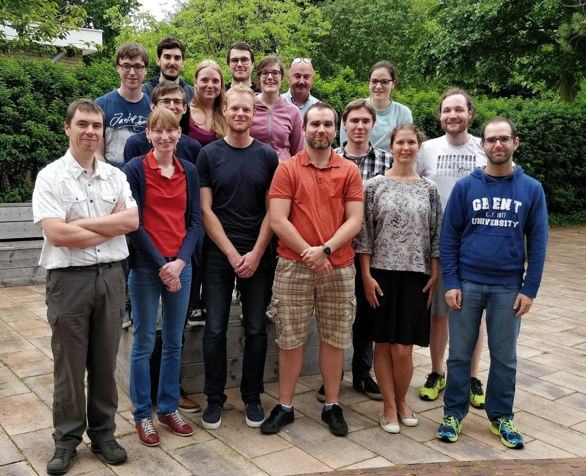

</div> 

---

# Single-cell bioinformatics in Ghent
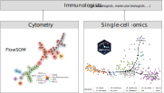

---

# Trajectory inference


---

# Trajectory inference

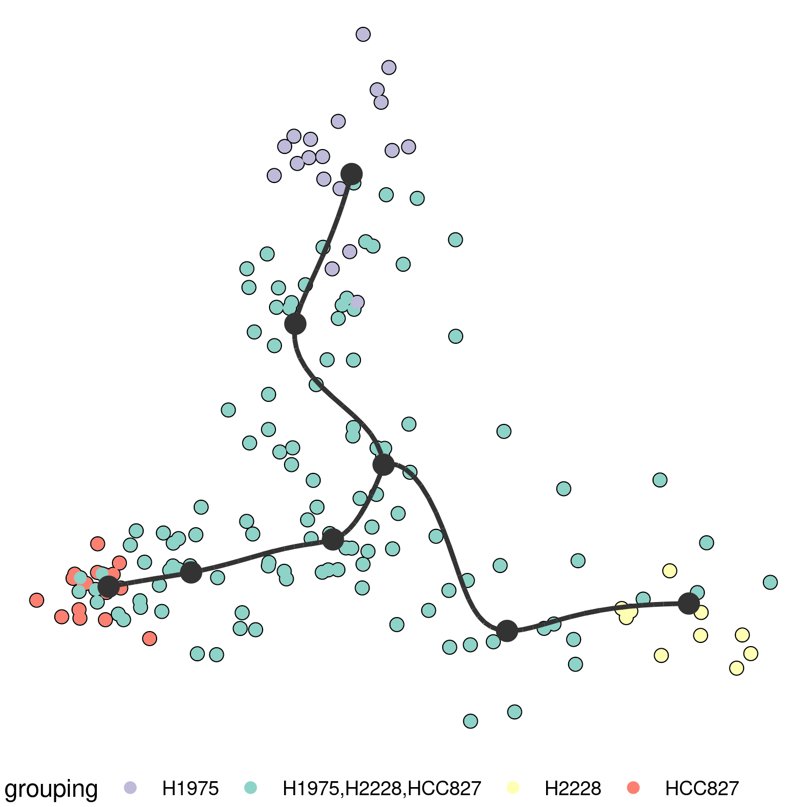

---

# Trajectory inference

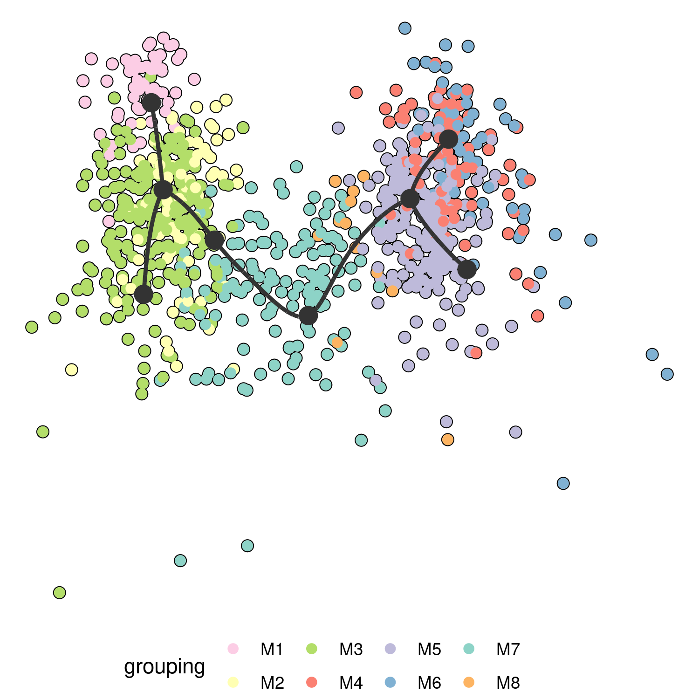

---

# Trajectory inference

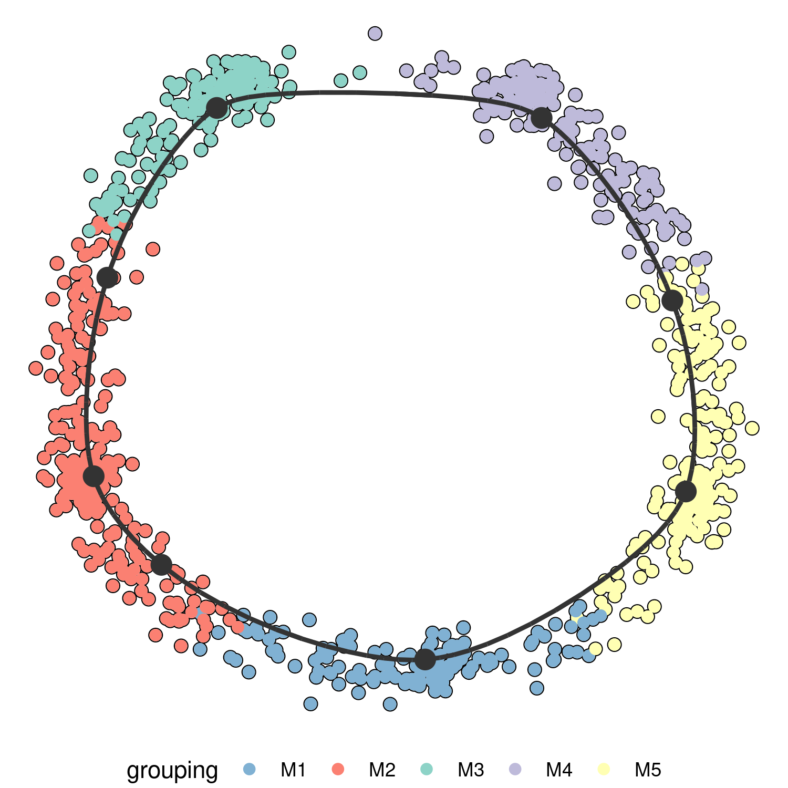

---

# Trajectory inference

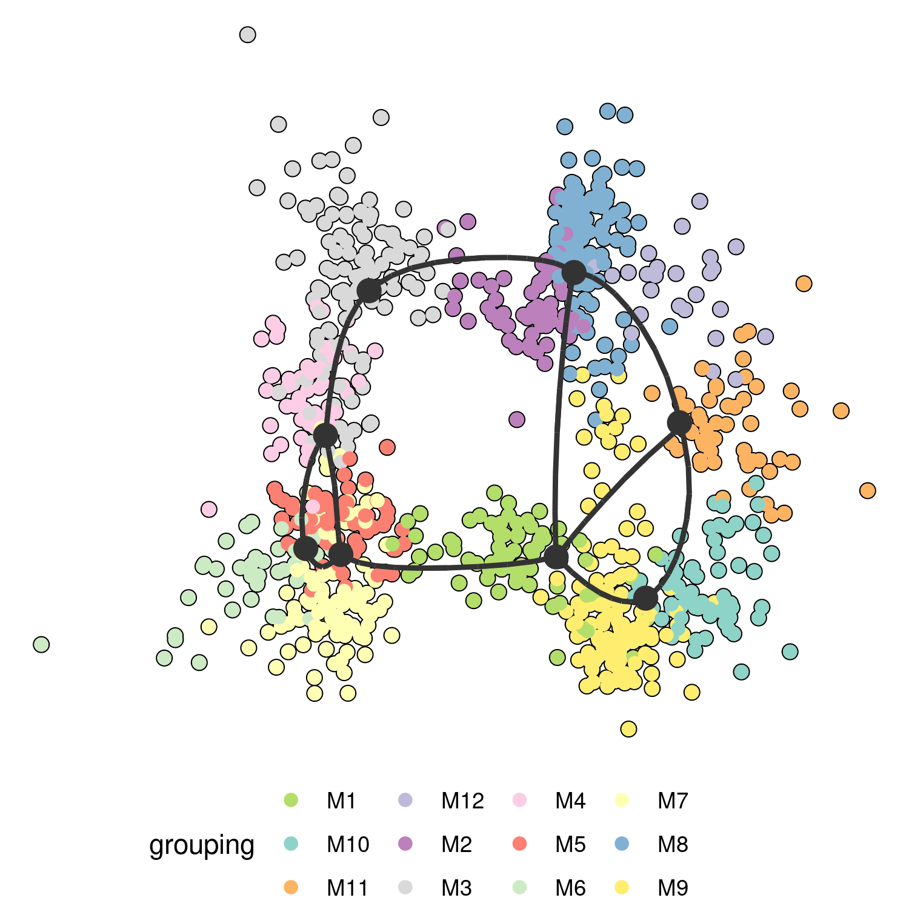

---

# Trajectory inference


> Computational methods for trajectory inference from single-cell transcriptomics.
<strong> Robrecht Cannoodt\* </strong> <a href='https://orcid.org/0000-0003-3641-729X'></a> <a href='https://github.com/rcannood'></a> <strong> Wouter Saelens\* </strong> <a href='https://orcid.org/0000-0002-7114-6248'></a> <a href='https://github.com/zouter'></a>,
<em> Yvan Saeys </em> <a href='https://github.com/saeyslab'></a>   [doi:10.1002/eji.201646347](https://doi.org/10.1002/eji.201646347)

---

# Trajectory inference


---

# Benchmarking trajectory inference


--

> A comparison of single-cell trajectory inference methods: towards more accurate and robust tools  
<strong> Wouter Saelens\* </strong> <a href='https://orcid.org/0000-0002-7114-6248'></a> <a href='https://github.com/zouter'></a>,<strong> Robrecht Cannoodt\* </strong> <a href='https://orcid.org/0000-0003-3641-729X'></a> <a href='https://github.com/rcannood'></a>,Helena Todorov <a href='https://github.com/Helena-todd'></a>,
<em> Yvan Saeys </em> <a href='https://github.com/saeyslab'></a>  
[bioRxiv:276907](https://www.biorxiv.org/content/early/2018/03/05/276907) [doi:10.1101/276907](https://doi.org/10.1101/276907)

--

<div class="statement">>> <a href="https://benchmark.dynverse.org">benchmark.dynverse.org</a> << </div>


---

# Quality control

<iframe src = "https://docs.google.com/spreadsheets/d/1Mug0yz8BebzWt8cmEW306ie645SBh_tDHwjVw4OFhlE/edit#gid=434813653"></iframe>


---

# Discussion with authors

<iframe src = "img/paga.html"></iframe>


---

# Probabilistic trajectory model
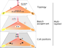

---

# Benchmarking metrics
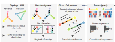

---

# Trajectory topology types
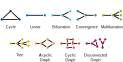

---

# Results can be... overwhelming

<embed src="img/results_summary.pdf#toolbar=0&navpanes=0&scrollbar=0" width="800" height="500" 
 type='application/pdf'>


---

# Results can be... overwhelming

<embed src="img/results_detailed.pdf#toolbar=0&navpanes=0&scrollbar=0" width="800" height="500" 
 type='application/pdf'>

---

# Guidelines for users *
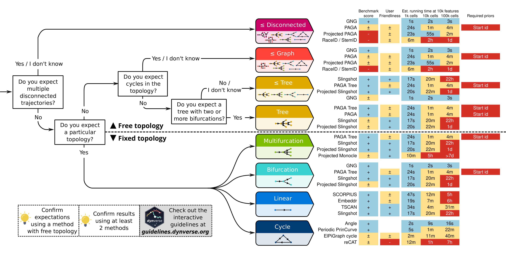

<i> * Based on how we interprete and aggregate the results</i>


---

# Guidelines for users

<iframe src = "http://guidelines.dynverse.org/"></iframe>

---

# Doing trajectory inference

  


<div class="statement"><a href="https://dyno.dynverse.org" class="url statement">dyno.dynverse.org</a></div>

---

# My current goal

<div class="statement">Integrate methods for trajectory differentially expressed genes/features</div>

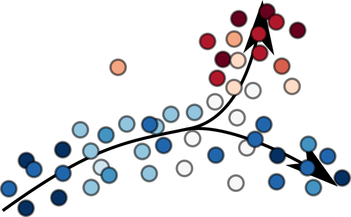

---

# Some limitations of our study

- **Authoritative**

> What with _alternative_ but _sensible_ interpretations?

--

- **Rapidly outdated**

> What if a new method comes along next week which _outperforms everything_?

--

- **Hard to adapt and extend**

> What if you want to add just one metric, would I need to _delve into this huge codebase_ and start _rerunning everything_?

--

- **This comes too late**

> It should have been published _before 60 methods were created_ (each with their own small benchmark) 

--

<p style="text-align:center;font-size:1.5em;"><i>Can we improve upon this? </i></p>

---

```{r, results="asis", echo = F}
# walk(fs::dir_ls("img/stages"), function(image_location) {
#   cat("# Why too late?\n")
#   cat(glue::glue("\n\n"))
#   cat("---\n")
# })
```

# Some <span class="wavy">nice</span> great attempts already

- **SummarizedBenchmark** (Rafael Irizarry lab, Bioconductor)


- **Dynamic Statistical Comparison** (Stephens Lab)

```yaml
DSC:
  define:
    simulate: en_sim, sparse, dense
    analyze: lasso, ridge, en, susie, susie02, susie04, susie05, susie01, susie_auto, varbvs, varbvsmix, BayesC
    score: pred_err, coef_err
  run: simulate * analyze * score
  exec_path: code
  R_libs: MASS, glmnet, BGLR, varbvs@pcarbo/varbvs/varbvs-r
```

---

# Some <span class="wavy">nice</span> great attempts already

<p class="statement">These are actually workflow managers, but with a focus on benchmarking.</p>
<p class="statement">And, our trajectory benchmark wouldn't have been possible with these tools...</p>

- One global environment
- Not fail-safe
- Still limited modularity
- Hard to maintain, as one non-working method breaks the pipeline
- ...

<p class="statement">And, to keep it maintainable, several other development tools are necessary, such as continuous integration</p>

---

```{r, results="asis", echo = F}
walk(fs::dir_ls("img/pipeline"), function(image_location) {
  cat("# The whole toolbox\n")
  cat(glue::glue("\n\n"))
  cat("---\n")
})
```

# Some food for thought

--

<span class="statement">Do you think this is feasable?</span>

--

<span class="statement">Would you participate in something like this?</span>

--

<br>


--

<br>

<table style = "width:100%">
<tr>
<td><a href="https://dynverse.org">`r fontawesome::fa("link")` dynverse.org</a></td>
<td><a href="https://github.com/dynverse">`r fontawesome::fa("github")` dynverse</a></td>
<td><a href="https://github.com/komparo">`r fontawesome::fa("github")` komparo</a></td>
<td><a href="https://github.com/zouter">`r fontawesome::fa("github")` zouter </a></td>
<td><a href="https://twitter.com/zouters">`r fontawesome::fa("twitter")` zouters</td>
</tr>
</table>
